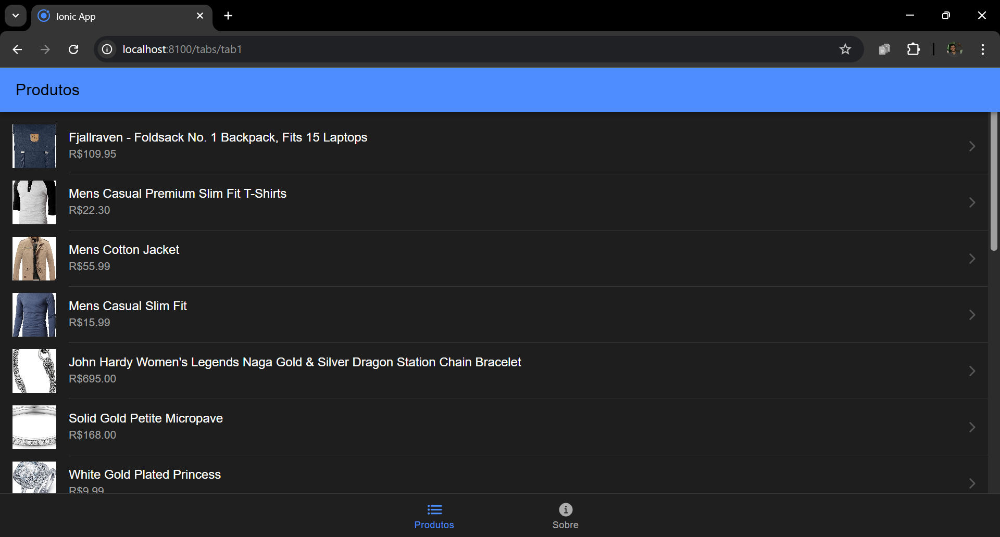
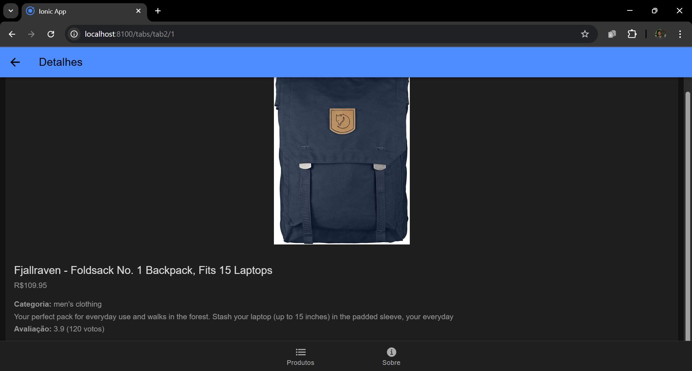
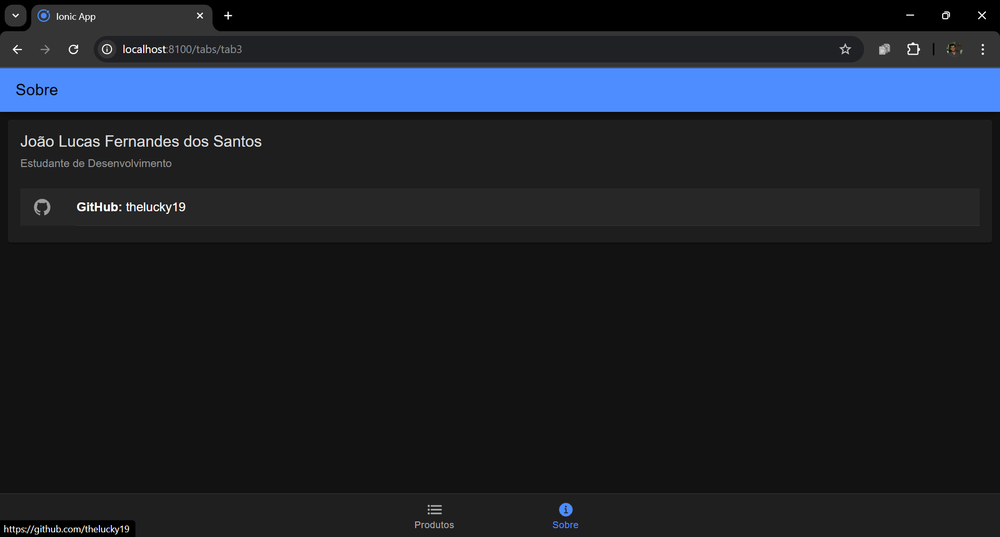
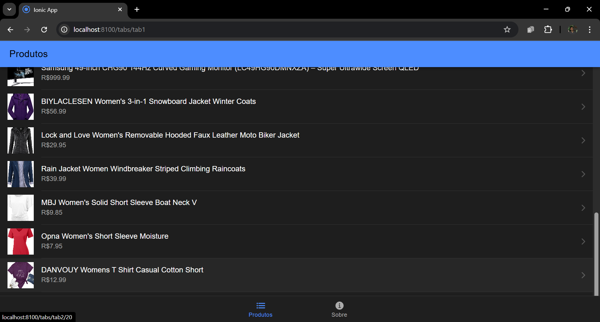
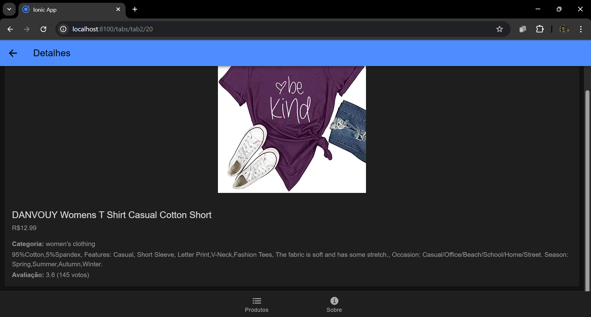

# 📱 Mobile Fake Store

Projeto de um aplicativo de e-commerce fictício desenvolvido com o framework Ionic e Angular.

## 📖 Descrição do projeto

Este é um aplicativo móvel desenvolvido como parte do projeto de avaliação acadêmica. O objetivo foi criar um app capaz de consumir dados da API pública [Fake Store API](https://fakestoreapi.com/), exibindo uma lista de produtos e permitindo a visualização de detalhes de cada item.

O projeto foi construído seguindo os padrões do Ionic com Angular, utilizando o template de navegação por abas (Tabs) e componentes nativos do Ionic para garantir uma boa experiência de usuário.

---

### 🖼️ Telas do Projeto

| Lista de Produtos | Detalhes do Produto | Aba Sobre |
| :---: | :---: | :---: |
|  |  |  |
|  |  


---

## 🛠️ Pré-requisitos

Antes de começar, você vai precisar ter instalado em sua máquina as seguintes ferramentas:
*   [Git](https://git-scm.com)
*   [Node.js (versão LTS)](https://nodejs.org/en/)
*   [Ionic CLI](https://ionicframework.com/docs/cli) (instalado via `npm install -g @ionic/cli`)

---

## 📥 Como baixar e rodar o projeto

Siga os passos abaixo para executar o projeto em sua máquina local.

```bash
# 1. Clone este repositório
git clone https://github.com/thelucky19/mobileFakeStore.git

# 2. Acesse a pasta do projeto no terminal
cd mobileFakeStore

# 3. Instale as dependências
npm install

# 4. Execute a aplicação em modo de desenvolvimento
ionic serve
```
Após executar o último comando, o projeto será aberto em seu navegador no endereço `http://localhost:8100/`.

---

## 🤝 Contribuindo com o projeto

Este é um projeto desenvolvido para fins de avaliação acadêmica, portanto, contribuições externas não serão aceitas. No entanto, sinta-se à vontade para criar um *fork* do projeto e adaptá-lo para seus próprios estudos e necessidades.

---

## 👨‍💻 Autor

| [<br><sub>github.com/thelucky19</sub>](https://github.com/thelucky19) |
| :---: |

Feito por **João Lucas Fernandes dos Santos**.

---

## 📝 Licença

Este projeto está sob a licença Creative Commons. Veja o arquivo [LICENSE](LICENSE) para mais detalhes.
